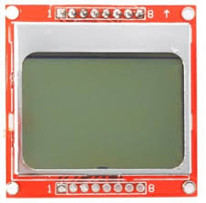

# PCD8544 LCD Driver Component for ESP32

This is ESP-IDF component for PCD8544 LCD controller. This lcd has been used in Nokia 5110/3310 phones.



## Main Features:
- Display string with 2 font sizes 5 x 7 and 3 x 5
- Graphic API to scroll display and draw lines, rectangles, circles and 84 x 48 bitmap
- Algorithm to update only changed area of display to increase speed

## Prerequisites

- ESP-IDF Framework

## Use PCD8544 component in your ESP-IDF project

Simply clone PCD8544 component into your `project_root/components` directory and it will be automatically integrated into the project.

If the project is a git repository you can include LVGL as a git submodule:

```
git submodule add https://github.com/deviousprophet/esp_pcd8544.git components/pcd8544
```

> It is recommended to add the component as a submodule in your IDF project's git repo.

## Configure

Run `idf.py menuconfig` and go to `Component config` -> `PCD8544 LCD Driver` to configure LCD driver.

## Demo Example

Check out [example](./example/)